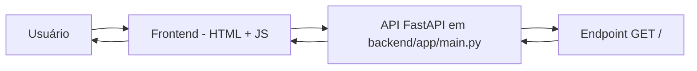

# Documentação do projeto iAvatar

## 1. Visão geral do projeto

### Explicação simples

Este projeto tem como ideia principal permitir que uma pessoa envie uma selfie e, com a ajuda de Inteligência Artificial, gere uma imagem mais profissional, adequada para uso em perfis como o LinkedIn.

A ideia é transformar uma foto pessoal em uma imagem com aparência mais refinada, alinhada ao ambiente profissional.

No estado atual do código, o projeto ainda está em fase inicial. Ele já possui:

- uma interface web com área para upload de imagem;
- um botão para verificar o status da API;
- um backend em Python com FastAPI;
- uma rota simples de teste que responde com `{"status": "ok"}`;
- uma interface visual pronta para continuar o desenvolvimento.

O que ainda não existe no código atual:

- upload real de imagem funcionando;
- envio da imagem ao backend;
- processamento de imagem;
- integração real com Inteligência Artificial;
- geração de avatar final;
- banco de dados;
- autenticação.

### Explicação um pouco mais técnica

O projeto foi pensado como uma aplicação com separação entre Frontend e Backend:

- Frontend: parte visual e interativa, feita em HTML, CSS e JavaScript;
- Backend: parte de servidor, feita em Python com FastAPI;
- API: camada que permite que o Frontend e o Backend se comuniquem.

No código real encontrado, a arquitetura atual é bem simples. O Frontend acessa a API para verificar se o servidor está funcionando. O Backend responde com um JSON simples. A parte de upload e geração de avatar ainda está preparada visualmente, mas não foi conectada a uma lógica real de processamento.

### Estágio atual do projeto

O projeto está em estágio inicial/prototipagem.

A documentação deste arquivo mostra exatamente o que foi implementado até o momento, sem inventar funcionalidades que ainda não existem.

---

## 2. Como o projeto funciona

A ideia geral do fluxo esperado pelo projeto é:

`Usuário → Frontend → API/Backend → Inteligência Artificial → Backend → Frontend → Usuário`

No código atual, esse fluxo ainda está incompleto. O que existe hoje é apenas a base da aplicação e o teste inicial de conexão entre Frontend e Backend.

### Fluxo real encontrado no projeto



### Explicação passo a passo

1. O usuário abre a página principal em HTML.
2. A interface mostra um botão para verificar o status da API.
3. O JavaScript do Frontend usa `fetch()` para chamar a API.
4. O Backend, em Python, recebe a requisição no endpoint `/`.
5. A função `health()` retorna um JSON com o status `ok`.
6. O Frontend exibe uma mensagem dizendo que a API está funcionando.

### O que ainda não existe no fluxo real

O fluxo completo de avatar ainda não está implementado. O projeto já mostra visualmente:

- área de upload;
- botão de gerar avatar;
- área de resultado;

Mas não há código que:

- capture o arquivo selecionado;
- envie o arquivo ao backend;
- validar a imagem;
- enviar a imagem para uma IA;
- receber o envio e mostrar o resultado final.

Esse ponto fica explícito em todo o código atual.

---

## 3. O que é Frontend neste projeto

### O que é Frontend?

Frontend é a parte da aplicação que o usuário vê e usa. É a parte visual, como botões, uploads, textos, imagens e interações.

Neste projeto, o Frontend é responsável por exibir a página e permitir que o usuário interaja com a ideia de upload da selfie e geração do avatar.

### Tecnologias usadas no Frontend

- HTML
- CSS
- JavaScript

### Arquivos do Frontend

#### `frontend/index.html`

**Responsabilidade:**

Arquivo principal da interface visual do projeto. Ele define a página com o título, o layout e os elementos que o usuário vê.

**Principais elementos encontrados:**

- cabeçalho com título "Avatar para LinkedIn";
- seção "Status da API";
- seção "Upload de Foto";
- seção "Gerar Avatar";
- seção "Resultado";
- área de upload com ícone;
- campo de entrada de arquivo;
- botão para gerar avatar;
- espaço reservado para mostrar o resultado final.

**Funções e elementos relevantes:**

- `#btnHealth`: botão que verifica a API;
- `#fileInput`: campo de seleção de arquivo;
- `#generateButton`: botão de gerar avatar;
- `#resultImage`: imagem exibida como resultado;
- `#apiStatus`: mensagem de sucesso quando a API está ok;
- `#apiStatusError`: mensagem de erro quando a API não responde.

#### `frontend/app.js`

**Responsabilidade:**

Arquivo JavaScript que controla a parte interativa da página.

**Funções encontradas:**

- `verificarStatus()`

**Objetivo da função `verificarStatus()`:**

Essa função faz uma requisição HTTP para a API local para verificar se o backend está funcionando.

**Entrada:**

Nenhuma entrada explícita por parâmetro. Ela usa o endereço da API fixo: `http://localhost:8000/`.

**Processamento:**

- faz um `fetch()` com método `GET`;
- envia um cabeçalho `Content-Type: application/json`;
- verifica se a resposta teve status HTTP OK;
- lê o JSON da resposta;
- mostra ou esconde mensagens na interface.

**Saída:**

Retorna `data` em caso de sucesso e lança um erro em caso de falha.

**Quem chama essa função:**

A função é associada ao clique do botão `btnHealth`:

```javascript
if (botao) {
    botao.addEventListener("click", verificarStatus);
}
```

### O que está implementado no Frontend

- página visual estrutural;
- botão para verificar status da API;
- área de upload da imagem;
- botão de gerar avatar visualmente preparado;
- exibição de mensagens de sucesso/erro.

### O que está preparado, mas não finalizado

O Frontend já mostra a estrutura da experiência de upload e geração de avatar, mas o código real para isso ainda não está conectado ao backend.

### O que ainda não está implementado no Frontend

- leitura do arquivo selecionado;
- validação do tipo/tamanho da imagem;
- envio da imagem via `FormData` ou outro formato;
- chamada para um endpoint de IA;
- tratamento do avatar retornado;
- atualização da imagem de resultado.

---

## 4. O que é Backend neste projeto

### O que é Backend?

Backend é a parte da aplicação que fica “por trás” da interface visual. Ela processa as requisições, acessa dados e comunica com outros serviços, como APIs externas ou serviços de IA.

Em linguagem simples: o Frontend pede algo; o Backend recebe, faz o processamento e devolve uma resposta.

### Linguagem utilizada

Python

### Framework utilizado

FastAPI

### Arquivo principal do Backend

#### `backend/app/main.py`

**Responsabilidade:**

Este é o arquivo principal do servidor. É onde a aplicação FastAPI é criada e onde as rotas são definidas.

**Estrutura do arquivo:**

```python
from fastapi import FastAPI
from fastapi.middleware.cors import CORSMiddleware

app = FastAPI()
```

A aplicação cria um objeto `app = FastAPI()`.

### Middleware

O código usa `CORSMiddleware`.

**Middleware** é um tipo de “intermediário” que fica entre a requisição e a resposta. Neste projeto, ele permite que o Frontend, que está em outra origem (por exemplo `http://localhost:5500` ou `http://localhost:8000`), possa se comunicar com o Backend mesmo com as regras de segurança do navegador.

**CORS** significa Cross-Origin Resource Sharing. Em outras palavras, ele permite que um site de uma origem diferente faça requisições para outra origem quando configurado corretamente.

No código atual, a configuração é:

```python
app.add_middleware(
    CORSMiddleware,
    allow_origins=[
        "http://localhost:5500",
        "http://127.0.0.1:5500",
        "http://localhost:8000",
        "http://127.0.0.1:8000",
        "null",
    ],
    allow_credentials=True,
    allow_methods=["*"],
    allow_headers=["*"],
)
```

Isso significa que o Frontend local pode acessar a API localmente.

### Rota existente

A rota atual é:

```python
@app.get("/")
def health():
    return {"status": "ok"}
```

**Função responsável:** `health()`

**Finalidade:**

Responder a uma requisição HTTP para confirmar que a API está funcionando.

**Método HTTP:** `GET`

**URL/rota:** `/`

**Resposta:**

```json
{"status": "ok"}
```

### Como o Backend funciona atualmente

O Backend funciona de forma bem simples:

1. o servidor inicia com FastAPI;
2. a aplicação escuta requisições HTTP;
3. a rota `/` recebe uma requisição do Frontend;
4. a função `health()` executa;
5. a API responde com um JSON;
6. a resposta volta para o Frontend.

### O que ainda não existe no Backend

Não há, no código atual:

- endpoints para upload de imagem;
- rotas para geração de avatar;
- integração com API externa de IA;
- modelos de dados;
- banco de dados;
- autenticação;
- serviços e controllers organizados em múltiplos arquivos.

---

## 5. O que é uma API neste projeto

### O que é uma API?

API é uma forma de permitir que duas partes de um sistema conversarem entre si.

Em português simples: a API funciona como uma “porta de comunicação” entre o Frontend e o Backend.

- O Frontend envia uma requisição.
- A API recebe essa requisição.
- O Backend processa aquilo que foi pedido.
- A API devolve uma resposta.

### API no contexto deste projeto

Neste projeto, a API ainda está muito simples. Ela serve principalmente para verificar se o backend está funcionando.

A parte do projeto que a pessoa usa é a interface web, mas a API é o mecanismo que conecta essa interface ao servidor.

### Endpoints encontrados

Até o momento, o único endpoint detectado no projeto é:

| Método HTTP | Endpoint | Finalidade | Arquivo responsável | Função responsável |
|---|---|---|---|---|
| GET | `/` | Verificar se a API está funcionando | `backend/app/main.py` | `health()` |

### Detalhamento do endpoint `/`

#### Método HTTP

`GET`

**GET** é um método HTTP usado para solicitar dados. Neste caso, o Frontend solicita o status da API.

#### URL/rota

`/`

A barra `/` representa a raiz da API. É a rota inicial.

#### Finalidade

Confirmar que o backend está disponível e respondendo.

#### Dados recebidos

Nenhum dado específico é enviado na requisição do Frontend.

#### Formato da requisição

O código front-end envia:

```javascript
fetch("http://localhost:8000/", {
  method: "GET",
  mode: "cors",
  headers: {
    "Content-Type": "application/json"
  }
});
```

Aqui, `fetch()` é uma função do JavaScript para fazer requisições HTTP. Ela é usada para falar com a API.

#### Formato da resposta

A API responde com JSON:

```json
{"status": "ok"}
```

#### Códigos HTTP utilizados

O código atual não mostra tratamento explícito de diferentes códigos HTTP além do `if (!response.ok)`. Esse trecho verifica se o status da resposta não foi bem-sucedido.

Em outras palavras, o código considera que qualquer resposta diferente de sucesso deve ser tratada como erro.

#### Possíveis erros

Se o servidor estiver desligado ou não responder, o JavaScript entra no bloco `catch` e exibe:

```html
Erro ao acessar a API.
```

### Observação importante sobre a API

A API do projeto ainda não implementa funções reais de upload, avatar, processamento de imagem e IA. O endpoint `/` é apenas um health check, ou seja, uma verificação de saúde do servidor.

---

## 6. Fluxo de upload da Selfie

### Como o fluxo está implementado hoje

O projeto possui a interface visual para upload, mas o fluxo completo ainda não foi implementado.

### Passo a passo do que existe no código

#### 1. Onde o usuário seleciona a imagem

No arquivo `frontend/index.html`, existe um campo de entrada de arquivo:

```html
<input
    id="fileInput"
    type="file"
    accept=".jpg,.jpeg,.png,.webp,image/jpeg,image/png,image/webp"
>
```

Esse input permite que o usuário selecione uma imagem do computador.

#### 2. Qual função captura o arquivo

No código atual, não existe nenhuma função que capture e processe esse arquivo.

**Não foi possível confirmar no código atual.**

#### 3. Como o arquivo é armazenado

Ainda não implementado.

Não há código que grava a imagem em memória, em disco ou em algum diretório.

#### 4. Como o Frontend envia o arquivo

Ainda não implementado.

Não há código com `FormData`, `FileReader`, `fetch` para upload de imagem, nem `POST` para um endpoint de upload.

#### 5. Qual endpoint recebe o arquivo

Não foi identificado no projeto.

**Ainda não implementado.**

#### 6. Como o Backend recebe o arquivo

Não foi identificado no projeto.

Não há uso de `UploadFile`, `Form`, `File` ou outra estrutura de FastAPI para receber imagem em upload.

#### 7. Como a imagem é validada

Ainda não implementado.

O código atual não mostra validação de:

- tipo de arquivo;
- extensão;
- tamanho;
- resolução;
- presença do arquivo.

#### 8. Como a imagem é processada

Ainda não implementado.

#### 9. Para onde ela é enviada

Não foi possível confirmar.

O código sugere esta finalidade, mas não é possível confirmar apenas pela implementação atual: a UI foi criada com a ideia de gerar um avatar, porém a lógica real de envio para serviço externo de IA ainda não existe.

#### 10. Como o resultado é recebido

Ainda não implementado.

#### 11. Como o resultado volta para o Frontend

Ainda não implementado.

#### 12. Como o Avatar é apresentado ao usuário

Há uma área de resultado preparada em HTML:

```html

```

Mas ela não está sendo preenchida por código no JavaScript atual.

### Conclusão sobre o fluxo de upload

O projeto já tem a estrutura visual para o upload da selfie, mas o fluxo real de upload e processamento ainda está em branco. Isso é uma parte claramente planejada, mas não concluída.

---

## 7. Inteligência Artificial

### O que foi identificado no código

Até o momento, não foi identificada nenhuma integração real com Inteligência Artificial.

Não há, no código atual:

- chamada a API da OpenAI ou de outro provedor;
- biblioteca específica de IA;
- função que envia imagem para processamento;
- função que recebe avatar gerado;
- variável de ambiente para chave de API;
- uso de modelos de imagem ou geração visual.

### O que existe no projeto que sugere IA

O objetivo do projeto e os textos do README e da interface sugerem que a ideia é usar IA para transformar a selfie em um avatar profissional.

Exemplos:

- README menciona o uso de inteligência artificial;
- título da página: "Avatar para LinkedIn";
- botão: "Gerar Avatar";
- frase de apresentação: "Gere avatares profissionais otimizados para o LinkedIn".

Mas isso ainda é apenas intenção do projeto, não uma implementação funcional confirmada.

### Conclusão sobre IA

**Ainda não implementado.**

O código mostra que a ideia existe, mas a integração com serviço de IA ainda não foi construída.

---

## 8. Bibliotecas e dependências

### Levantamento das dependências da API

O arquivo `backend/requirements.txt` contém as dependências atuais do Backend.

| Biblioteca | Versão | Frontend/Backend | Para que serve | Onde é usada |
|---|---|---|---|---|
| `fastapi` | `0.140.0` | Backend | Framework principal para criar a API web em Python | `backend/app/main.py` |
| `uvicorn` | `0.51.0` | Backend | Servidor ASGI para rodar a aplicação FastAPI | documentação e execução do projeto |
| `starlette` | `1.3.1` | Backend | Biblioteca base usada pelo FastAPI para lidar com requisições HTTP | indireta via FastAPI |
| `pydantic` | `2.13.4` | Backend | Validação e serialização de dados | usada por FastAPI para modelagem de entrada/saída |
| `pydantic_core` | `2.46.4` | Backend | Motor interno da validação do Pydantic | indireta via FastAPI/Pydantic |
| `annotated-types` | `0.8.0` | Backend | Tipos auxiliadores para anotações do Python | indireta via Pydantic |
| `annotated-doc` | `0.0.4` | Backend | Biblioteca auxiliar de documentação/anotações | não identificada como usada diretamente no projeto |
| `anyio` | `4.14.2` | Backend | Biblioteca para concorrência assíncrona | usada por FastAPI/Starlette |
| `click` | `4.2`? Observação: no arquivo está `click==8.4.2` | Backend | CLI e execução de comandos | usado por ferramentas da stack Python |
| `colorama` | `0.4.6` | Backend | Formatação de saída de terminal em Windows | útil em ambiente de console |
| `h11` | `0.16.0` | Backend | Implementação do protocolo HTTP/1.1 | parte da stack ASGI |
| `idna` | `3.18` | Backend | Suporte a nomes internacionais de domínio | parte da stack do FastAPI |
| `typing-inspection` | `0.4.2` | Backend | Utilitário de análise de tipos | indireta |
| `typing_extensions` | `4.16.0` | Backend | Suporte a recursos novos de tipagem | indireta |

### Observações importantes

- O documento `README.md` menciona JavaScript, HTML e CSS, então essas tecnologias fazem parte do Frontend.
- Não foi identificado nenhum arquivo `package.json` no projeto atual.
- Não foi identificada dependência do Frontend gerenciada por npm ou outro gerenciador.
- Não há integração real com bibliotecas de IA hoje.

### Importância das dependências no projeto

As dependências atuais servem para permitir que o backend funcione com FastAPI e Uvicorn, algo essencial para a API local. O que faltando é a parte de upload e a parte de IA.

---

## 9. Funções

### Funções identificadas no projeto

#### `health()`
**Arquivo:** `backend/app/main.py`

**Objetivo:**

Retornar um JSON indicando que a API está funcionando.

**Entrada:**

Nenhuma entrada explícita.

**Processamento:**

A função simplesmente retorna:

```python
{"status": "ok"}
```

**Saída:**

Um dicionário em JSON com o campo `status`.

**Quem chama essa função:**

A própria rota `@app.get("/")` chama essa função automaticamente quando a URL raiz da API é acessada.

**O que aconteceria se ela falhasse:**

O Frontend não receberia a resposta esperada e a mensagem de erro apareceria na tela.

#### `verificarStatus()`
**Arquivo:** `frontend/app.js`

**Objetivo:**

Verificar se a API está disponível e funcionando.

**Entrada:**

Nenhuma entrada explícita.

**Processamento:**

- usa `fetch()` para acessar `http://localhost:8000/`;
- verifica `response.ok`;
- lê `response.json()`;
- decide se deve mostrar sucesso ou erro na interface.

**Saída:**

Retorna os dados recebidos em caso de sucesso ou dispara erro em caso de falha.

**Quem chama essa função:**

O botão `btnHealth` chama essa função quando clicado.

**O que aconteceria se ela falhasse:**

O usuário veria a mensagem de erro: "Erro ao acessar a API."

### Outras funções não encontradas

Não há código real implementado para:

- upload da imagem;
- tratamento da selfie;
- processo de avatar;
- chamada à IA;
- exibição do avatar gerado.

Essas partes estão visuais/previstas no Frontend, mas ainda não existem como funções funcionando.

---

## 10. Estrutura de pastas e arquivos

### Estrutura real do projeto

```text
projeto/
├── README.md
├── DOCUMENTACAO_PROJETO.md
├── backend/
│   ├── requirements.txt
│   ├── venv/
│   └── app/
│       └── main.py
├── frontend/
│   ├── index.html
│   └── app.js
└── .git/
```

### Explicação das pastas

#### `backend/`

Pasta responsável pela aplicação backend.

**Arquivos e papel:**

- `requirements.txt`: lista as bibliotecas do projeto.
- `app/main.py`: arquivo principal da API FastAPI.
- `venv/`: ambiente virtual para isolar as dependências do Python.

#### `frontend/`

Pasta responsável pela interface visual.

**Arquivos e papel:**

- `index.html`: estrutura e layout visual da aplicação.
- `app.js`: lógica JavaScript da página.

#### `README.md`

Arquivo de documentação resumida do projeto.

Ele informa o objetivo geral do projeto e os passos básicos para executar a aplicação.

#### `.git/`

Diretório de controle de versão do Git. Não é parte da lógica da aplicação, mas indica que o projeto está sendo versionado.

---

## 11. Comunicação entre Frontend e Backend

### Como a comunicação ocorre no código atual

A comunicação acontece por meio de `fetch()` no JavaScript do Frontend.

**Exemplo real do código:**

```javascript
const response = await fetch("http://localhost:8000/", {
    method: "GET",
    mode: "cors",
    headers: {
        "Content-Type": "application/json"
    }
});
```

### Quem inicia a comunicação

O Frontend inicia a comunicação quando o usuário clica no botão de status da API.

### Qual método HTTP é utilizado

`GET`

### Qual endpoint é chamado

`/`

### Quais dados são enviados

No código atual, a requisição envia apenas o cabeçalho `Content-Type: application/json`.

O corpo da requisição não contém dados extras.

### Como a resposta é recebida

A resposta é lida com:

```javascript
const data = await response.json();
```

`response.json()` converte a resposta da API em um objeto JavaScript para ser usado no Frontend.

### Como erros são tratados

Se a resposta não for bem sucedida, o código executa:

```javascript
throw new Error(`Erro HTTP: ${response.status}`);
```

Se a requisição falhar por problema de rede, CORS ou servidor fora do ar, o código entra no bloco `catch` e mostra a mensagem:

```html
Erro ao acessar a API.
```

### Observação importante

A comunicação existente hoje é apenas uma verificação de status. Ainda não há comunicação real para upload de imagem, processamento ou retorno do avatar.

---

## 12. Requisições e respostas

### Requisição de status da API

#### Requisição

```http
GET http://localhost:8000/
Content-Type: application/json
```

#### Explicação

- `GET`: solicita dados;
- `http://localhost:8000/`: endereço do servidor local;
- `/`: raiz da API;
- `Content-Type: application/json`: informa ao servidor que a requisição está enviando JSON.

#### Resposta esperada

```json
{"status": "ok"}
```

Essa resposta é gerada pela função `health()` em `backend/app/main.py`.

### Requisições que ainda não existem

No código atual, não existem requisições reais como:

```http
POST /upload
POST /generate-avatar
```

Essas são ideias do projeto, mas ainda não foram implementadas.

---

## 13. Tratamento de erros

### Erros que já existem no código

#### 1. Falha da conexão com a API

No Frontend, o código usa `try/catch`:

```javascript
try {
    const response = await fetch(...);
    if (!response.ok) {
        throw new Error(`Erro HTTP: ${response.status}`);
    }
    const data = await response.json();
    ...
} catch (error) {
    apiStatusError.style.display = "block";
    apiStatus.style.display = "none";
    throw error;
}
```

Isso significa que se houver erro na rede ou se a API não responder corretamente, a mensagem de erro é exibida ao usuário.

#### 2. Resposta HTTP inválida

O código verifica:

```javascript
if (!response.ok)
```

Se a resposta da API não for considerada bem-sucedida, o código trata como erro.

#### 3. Falha no carregamento da API

O usuário recebe a mensagem:

```html
Erro ao acessar a API.
```

### Erros ainda não tratados no código

O projeto não trata, no código atual:

- upload sem arquivo;
- arquivo com extensão inválida;
- imagem muito grande;
- erro no processamento da IA;
- erro ao receber a resposta do serviço externo;
- erro ao mostrar o resultado final.

### Conclusão

O tratamento de erro existe apenas para a verificação simples da API. O restante da aplicação ainda não foi implementado em termos reais de upload e processamento.

---

## 14. Variáveis de ambiente e segurança

### O que é uma variável de ambiente?

Uma variável de ambiente é um valor guardado fora do código principal, normalmente em um arquivo como `.env` ou em configurações do sistema operacional.

Ela é útil para guardar informações sensíveis, como:

- chaves de API;
- URLs de serviços;
- senhas;
- tokens;
- credenciais.

### Por que isso importa?

Porque se uma chave secreta ficar escrita diretamente no código, ela pode vazar para outras pessoas ou para repositórios públicos.

### O que existe no projeto

No projeto atual, não foi identificado nenhum arquivo `.env`, `.env.example` ou qualquer variável de ambiente real.

Não há também nenhuma API Key ou token configurado no código.

### Situação atual

**Ainda não implementado.**

Isso significa que, até agora, não existe no projeto uma integração com serviço externo que precise de chave de autenticação.

### Importante

Se futuramente o projeto usar uma API de IA, será importante criar algo como:

```env
OPENAI_API_KEY=sua_chave_aqui
```

Mas isso ainda não aparece no código atual.

---

## 15. Decisões técnicas identificadas

### Decisão 1: uso de Python + FastAPI

**Evidência:** arquivo `backend/requirements.txt` e `backend/app/main.py`.

**O que isso mostra:**

O backend foi escolhido em Python e o framework principal foi FastAPI.

**Motivo conhecido:**

O código e a documentação mostram que o objetivo é construir uma API simples e rápida.

**Motivo não identificado:**

Não foi encontrado texto detalhado explicando por que FastAPI foi escolhido especificamente para este projeto além do fato de que ele é usado para o backend da aplicação.

### Decisão 2: separação de Frontend e Backend

**Evidência:** pastas `frontend/` e `backend/`.

**O que isso mostra:**

A ideia do projeto é dividir visualização e lógica do servidor em camadas diferentes.

**Motivo conhecido:**

A estrutura do projeto sugere uma boa organização para aprendizado e para expansão do sistema.

### Decisão 3: uso de HTML, CSS e JavaScript para a interface

**Evidência:** `frontend/index.html`, `frontend/app.js`.

**O que isso mostra:**

O Frontend foi implementado em tecnologias web tradicionais e simples.

**Motivo conhecido:**

Essas tecnologias são fáceis de aprender e adequadas para prototipagem inicial.

### Decisão 4: uso de CORS

**Evidência:** `CORSMiddleware` em `backend/app/main.py`.

**O que isso mostra:**

A comunicação entre Frontend e Backend foi pensada para funcionar em desenvolvimento local usando portas diferentes.

**Motivo conhecido:**

O projeto usa `localhost` em diferentes portas e, por isso, a política CORS foi configurada.

### Decisão 5: estrutura inicial preparação para upload/IA

**Evidência:** elementos HTML de arquivo e botão de avatar.

**O que isso mostra:**

O código visual sugere que o projeto foi planejado para evoluir para upload de imagem e geração do avatar.

**Motivo conhecido:**

O texto do README e os nomes dos elementos indicam essa intenção.

**Motivo não identificado:**

Ainda não há implementação funcional dessa etapa.

---

## 16. O que já foi concluído

### Frontend

- interface visual principal criada;
- logo e título do projeto presentes;
- seção de status da API;
- seção de upload de foto visualmente implementada;
- botão de gerar avatar visualmente preparado;
- área de resultado preparada;
- mensagem de sucesso/erro da API implementada.

### Backend

- servidor FastAPI configurado;
- rota raiz `/` funcionando;
- resposta JSON com status da API;
- configuração de CORS para desenvolvimento local.

### API

- endpoint `GET /` funcionando;
- resposta simples de status confirmada.

### Inteligência Artificial

**Ainda não implementado.**

---

## 17. O que está parcialmente implementado

### Interface de upload

**Existe:**

- label visual para upload;
- input de arquivo;
- textos explicando como selecionar a imagem;
- botão de gerar avatar.

**Falta:**

- lógica para capturar o arquivo;
- validação da imagem;
- envio para backend;
- resposta e processamento real.

### Comunicação Frontend/Backend

**Existe:**

- chamada do Frontend para a API de status.

**Falta:**

- envio de imagem;
- retorno de avatar;
- comunicação com IA.

### Preparação para evolução do projeto

O código mostra a base para o próximo passo, mas o fluxo da funcionalidade principal ainda não está concluído.

---

## 18. O que ainda não foi implementado

Com base no código atual, os itens abaixo podem ser identificados com segurança como ainda não implementados:

- upload real de selfie;
- envio da imagem ao backend;
- validação de arquivo no servidor;
- processamento da imagem;
- integração com serviço de IA;
- geração do avatar profissional;
- retorno do avatar ao Frontend;
- armazenamento de imagem;
- banco de dados;
- autenticação;
- variáveis de ambiente para API Key;
- tratamento de erros do fluxo de geração de avatar;
- backend com múltiplas rotas de negócio;
- estrutura de services/controllers/models.

---

## 19. Pontos de atenção

### 1. O fluxo principal ainda não existe na prática

O projeto mostra a ideia visual da aplicação, mas ainda não implementa a lógica central: receber uma selfie, processar e devolver um avatar.

### 2. Frontend e Backend ainda estão desconectados do objetivo principal

O Frontend faz uma verificação de status da API, mas não envia imagem, não chama um serviço de IA e não recebe resultado.

### 3. A API está em fase de teste simples

Hoje a API serve apenas para responder se o servidor está online. Isso é útil para verificar a conexão, mas não representa a funcionalidade final do projeto.

### 4. Falta validação de imagem real

O input aceita tipos como JPG, PNG e WEBP, mas não há código para verificar a imagem no servidor.

### 5. Falta integração com IA

Não há evidência de uso de API de IA ou processamento de imagem em código.

### 6. CORS foi configurado, o que é bom para desenvolvimento local

No entanto, essa configuração não substitui a criação real da comunicação funcional entre as partes do sistema.

### 7. Estrutura simples e didática, mas incompleta

A organização atual é adequada para iniciar, mas não cobre ainda a arquitetura completa esperada para um fluxo real de avatar profissional.

---

## 20. Glossário para iniciantes

### API

API significa Application Programming Interface, ou Interface de Programação de Aplicações. É uma forma de diferentes partes de um sistema conversarem entre si. No projeto, a API permite que o Frontend fale com o Backend.

### Backend

Backend é a parte do sistema que fica “atrás” da interface. Ela processa requisições, executa regras de negócio e devolve respostas.

### Frontend

Frontend é a parte da aplicação que o usuário vê e usa. Inclui páginas, botões, formulários, imagens e interações.

### Endpoint

Endpoint é uma URL específica de uma API. Cada endpoint normalmente representa uma ação ou recurso. No projeto, o endpoint principal é `/`.

### HTTP

HTTP é o protocolo usado para troca de informações na web. É a base da comunicação entre navegador, Frontend, Backend e API.

### GET

Método HTTP usado para solicitar dados. O Frontend faz `GET` para verificar o status da API.

### POST

Método HTTP usado para enviar dados para o servidor, como um formulário ou um arquivo. Ainda não foi usado no projeto atual para upload de selfie.

### Request

Request é a requisição enviada pelo cliente para a API. Pode incluir dados, cabeçalhos e método HTTP.

### Response

Response é a resposta enviada pela API. Pode conter dados, mensagens e códigos de status.

### JSON

JSON é um formato leve de troca de dados. É muito usado em APIs. Exemplo:

```json
{"status": "ok"}
```

### Multipart/form-data

É um formato usado para enviar arquivos junto com outros dados, como uma imagem e um texto ao mesmo tempo. Ainda não foi utilizado no projeto atual.

### Middleware

Middleware é um trecho de código que fica entre a requisição e a resposta, podendo alterar ou monitorar essa comunicação. Neste projeto, o `CORSMiddleware` foi usado.

### CORS

CORS é a política de segurança que controla acessos entre origens diferentes. Foi configurada para permitir que o Frontend local acesse a API local.

### Biblioteca

Biblioteca é um conjunto de código já pronto que facilita o desenvolvimento. Exemplo: FastAPI, Uvicorn, Pydantic.

### Framework

Framework é uma estrutura que ajuda a organizar o desenvolvimento de uma aplicação. FastAPI é um framework para criar APIs em Python.

### Dependência

Dependência é uma biblioteca necessária para o projeto funcionar. Ela fica listada em `requirements.txt`.

### Ambiente virtual

Ambiente virtual é uma pasta isolada onde as bibliotecas do projeto ficam instaladas, sem misturar com o restante do computador. O projeto tem uma pasta `backend/venv`.

### Variável de ambiente

É um valor configurado fora do código, usado para guardar informações sensíveis ou de configuração.

### Upload

Upload significa enviar um arquivo do computador para a aplicação.

### Base64

Base64 é uma forma de converter dados binários em texto para facilitar transferência. Ainda não foi identificado no projeto.

### Async/Await

São recursos do JavaScript e Python para lidar com operações assíncronas, como requisições HTTP de forma mais organizada. No código atual, aparecem no uso de `await fetch(...)`.

### Promise

Promise é um objeto usado em JavaScript para representar uma operação que pode terminar no futuro. O `fetch()` usa promessas internamente.

### Status Code

Status Code é um número que indica o resultado de uma requisição HTTP. Por exemplo, `200` significa sucesso e `404` significa recurso não encontrado. O código atual verifica se a resposta foi bem-sucedida usando `response.ok`.

---

## 21. Como explicar este projeto para outra pessoa

Se eu precisasse explicar este projeto para outra pessoa, eu diria assim:

> "Este projeto visa criar uma aplicação em que o usuário envie uma selfie e, com ajuda de Inteligência Artificial, gere uma imagem profissional para uso no LinkedIn. O objetivo é transformar uma foto pessoal em uma versão mais refinada para uso profissional."

> "Ele funciona com uma parte visual, o Frontend, e uma parte de servidor, o Backend. O Frontend mostra a interface e, no momento atual, verifica se a API está funcionando. O Backend é construído em Python com FastAPI e expõe uma rota simples que responde com status. A API é o ponto de comunicação entre o Frontend e o Backend."

> "A Inteligência Artificial ainda não está integrada ao código atual. O projeto já mostra a ideia visual para upload e geração do avatar, mas a parte de processamento real e geração final ainda precisa ser desenvolvida."

---

## 22. Resumo técnico final

| Item | Tecnologia / Implementação atual |
|---|---|
| Frontend | HTML, CSS e JavaScript |
| Backend | Python + FastAPI |
| Linguagem | Python e JavaScript |
| Framework | FastAPI |
| API | `GET /` para verificar status |
| IA | Não identificada no código atual |
| Upload | Interface visual pronta, funcionalidade real ainda não implementada |
| Banco de dados | Não identificado no projeto |
| Autenticação | Não identificado no projeto |
| Principais bibliotecas | FastAPI, Uvicorn, Starlette, Pydantic |
| Comunicação Frontend/Backend | `fetch()` para `http://localhost:8000/` |
| Arquivos principais | `frontend/index.html`, `frontend/app.js`, `backend/app/main.py` |
| Estado geral | Prototipação inicial |

---

## Conclusão final

Este projeto está em uma etapa inicial e muito didática. Ele já possui a base fundamental de uma aplicação web: Frontend, Backend, API e comunicação local de teste.

O que já está funcionando de forma real:

- a interface web foi criada;
- a API responde com status;
- o Frontend consegue verificar se o servidor está no ar.

O que ainda precisa ser desenvolvido:

- upload real da selfie;
- processamento da imagem;
- integração com Inteligência Artificial;
- retorno do avatar final para o usuário.

Em outras palavras, o projeto já tem a estrutura básica e a intenção clara, mas a funcionalidade principal de gerar o avatar ainda não existe no código atual.

Isso é importante para o aprendizado: o projeto já mostra a jornada de desenvolvimento de uma aplicação real, mas ainda está em uma fase anterior à implementação completa da solução final.
